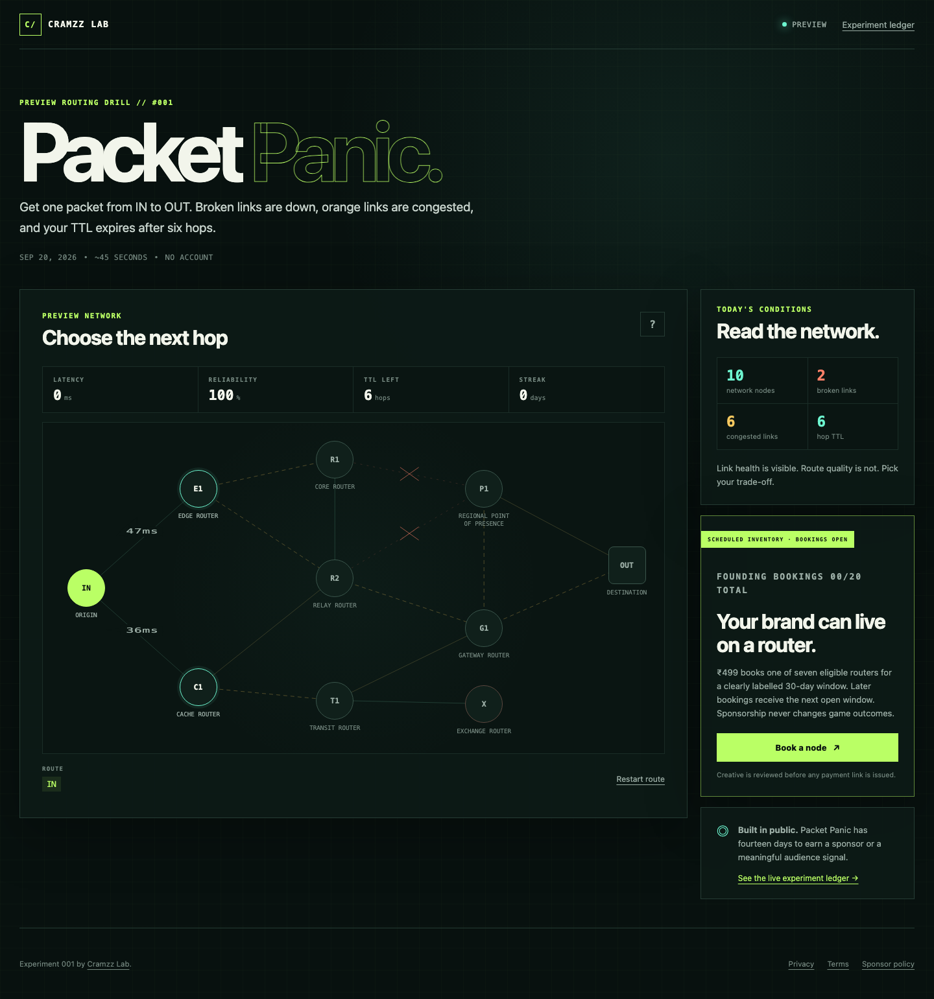
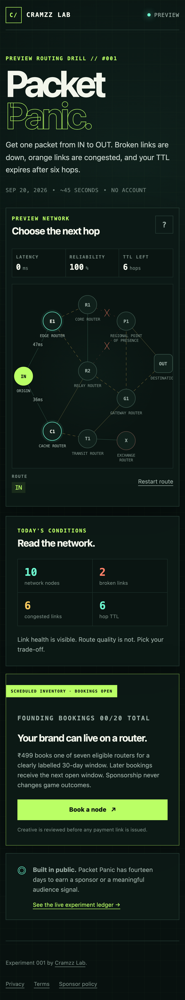

# Packet Panic

Packet Panic is Cramzz Lab's first public experiment: a fast, daily network-routing puzzle for developers, infrastructure engineers, and technically curious people.

Players route one packet from **IN** to **OUT** while balancing latency, reliability, congestion, broken links, and a six-hop TTL. The puzzle is deterministic for each UTC date, works without an account, and stores streaks only in the player's browser.

## Screenshots

| Desktop | Mobile |
| --- | --- |
|  |  |

## Run locally

Requirements: an active Node.js LTS release (20, 22, or 24) and npm 10 or newer.

```bash
npm install
npm run dev
```

The production integration uses a configurable base path:

```bash
VITE_BASE_PATH=/e/packet-panic/ npm run build
npm run preview
```

The output is written to `dist/`. The Cramzz hub vendors that directory from a pinned Git commit. Release builds pass the resolved 40-character SHA as `EXPERIMENT_SOURCE_COMMIT`; Vite stamps that exact value into `dist/experiment.json`. The checked-in source manifest deliberately uses the shared contract's `UNPINNED` sentinel because a commit cannot contain its own final SHA.

## Commands

| Command | Purpose |
| --- | --- |
| `npm run typecheck` | Strict TypeScript validation |
| `npm test` | Determinism, route, storage, and analytics unit tests |
| `npm run test:e2e` | Build, then smoke-test the production artifact in Chrome, Firefox, WebKit, Android-size, and iOS-size profiles |
| `npm run audit` | Stress 10,000 deterministic puzzle dates and print the score distribution |
| `npm run secrets:scan` | Reject common committed credential patterns |
| `npm run build` | Typecheck and create the static production bundle |
| `npm run manifest:verify` | Verify the built manifest's source pin contract |
| `npm run metadata:verify` | Verify crawler-visible canonical and social metadata in built HTML |
| `npm run release:verify` | Prove the public manifest and puzzle epoch agree; set `REQUIRE_LAUNCH_DATE=true` for a launch build |
| `npm run check` | Full local CI excluding browser smoke tests |

## Runtime configuration

- `VITE_BASE_PATH` — mount path, default `/e/packet-panic/`.
- `VITE_PREVIEW_PUZZLE_EPOCH` — deterministic preview epoch used only while `experiment.json` has `launchDate: null`; ignored after a real launch date is recorded.
- `VITE_SPONSOR_FORM_URL` — approved `https://tally.so/…` sponsor application form. When omitted or invalid, the call to action links to `/sponsor-policy`.
- `VITE_POSTHOG_KEY` — optional public PostHog project token.
- `VITE_POSTHOG_HOST` — matching HTTPS ingestion origin, such as `https://us.i.posthog.com`.

No secret belongs in a `VITE_` variable: Vite embeds these values into the public bundle.

Founding Node placements use the fail-closed static contract in [SPONSORS.md](./SPONSORS.md). The offer is 20 total bookings at ₹499 for 30 days each, with no more than the seven eligible routers active concurrently; later buyers receive the next non-overlapping window. The committed inventory stays empty until creative review and manual confirmation of a captured payment.

## Privacy and analytics

The experiment does not load an analytics SDK. Production builds send only manually allowlisted events to PostHog's public capture endpoint when both analytics variables are configured; development and incomplete configurations remain network-silent. The adapter uses a random site-scoped ID that rotates after 30 days, respects DNT and Global Privacy Control, and explicitly disables person profiles and GeoIP enrichment. Autocapture and session replay are not present.

See [PRIVACY.md](./PRIVACY.md) for the exact data contract and [EXPERIMENT.md](./EXPERIMENT.md) for the fixed validation rules.

## Deployment

Pull requests must pass secret scanning, type checking, unit tests, production build, and Playwright smoke tests. `main` produces an immutable `dist` artifact stamped with `${{ github.sha }}`; the hub deploys only a reviewed, pinned commit and supplies that same SHA while vendoring. `render.yaml` also supports a root-mounted Render preview, which is intentionally marked unpinned.

The game reads its epoch from the same public `experiment.json` launch date that the hub displays. While that value is `null`, the UI labels itself **Preview** and uses the preview-only epoch. Before DNS cutover, set the actual date in the manifest, build, then run `REQUIRE_LAUNCH_DATE=true npm run release:verify`; the check fails if the built manifest and public `puzzle-config.json` diverge or the launch date is still unset.

## License

MIT. See [LICENSE](./LICENSE).
